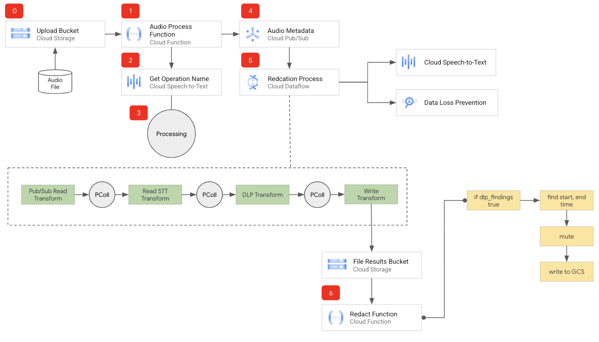
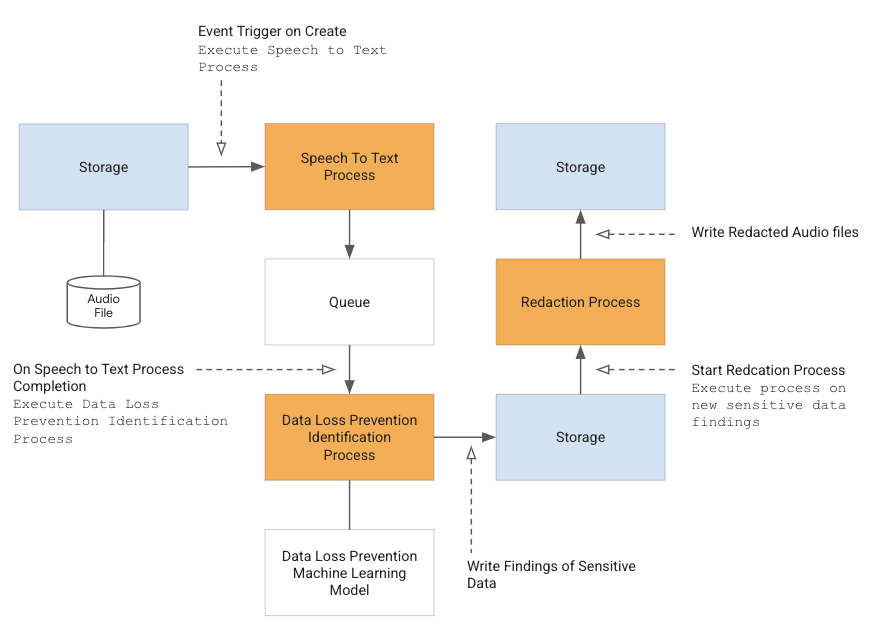

# Speech Redaction Framework

This repository contains the Speech Redaction Framework, a collection of components and code from Google Cloud that you can use to redact sensitive information from audio files.

It can and:
* Process uploaded audio files to Cloud Storage.
* Write the findings to Google Cloud Storage.
* Redact sensitive information from the **audio file** with Google Cloud Data Loss Prevention API.






Speech Redaction Framework Limitations:
* The framework can only process .wav or .flac files. This is a limitation within the Framework code not Cloud Speech-to-Text API.

The process follows:


0. An audio file is uploaded to Cloud Storage.
1. The Cloud Function is triggered on object.create.
2. The Audio Process Cloud Function sends a long running job request to Cloud Speech-to-Text.
3. Speech-to-Text processes audio file.
4. The Cloud Function then sends the job ID from Cloud Speech-to-Text with additional metadata to Cloud Pub/Sub.
5. The Cloud Dataflow job identifies sensitive information and writes the findings to a JSON file on Cloud Storage.
6. A second Cloud Function is triggered on object.create that reads the findings JSON file, redacts sensitive information from the audio file and writes the redacted audio file to Cloud Storage.

## Roles needed

Grant the necessary IAM roles either through the Google Cloud Console or by using the ```gcloud``` commands provided below.

#### 1. Add the following roles to Compute Engine default service account (PROJECT_NUMBER-compute@developer.gserviceaccount.com):

- Eventarc Event Receiver role
- Cloud Speech-to-Text Service Agent
- DLP User
- DLP Administrator
- Pub/Sub Admin
- Pub/Sub Subscriber
- Pub/Sub Viewer
- Dataflow Worker
- Cloud Run Invoker

```gcloud``` commands:

```shell
export PROJECT_ID="<PROJECT_ID>" 

export GCE_SERVICE_ACCOUNT="$(gcloud projects describe ${PROJECT_ID} --format='value(projectNumber)')-compute@developer.gserviceaccount.com"

gcloud projects add-iam-policy-binding ${PROJECT_ID} \ --member="serviceAccount:${GCE_SERVICE_ACCOUNT}" \ --role="roles/eventarc.eventReceiver" 

gcloud projects add-iam-policy-binding ${PROJECT_ID} \ --member="serviceAccount:${GCE_SERVICE_ACCOUNT}" \ --role="roles/speech.serviceAgent" 

gcloud projects add-iam-policy-binding ${PROJECT_ID} \ --member="serviceAccount:${GCE_SERVICE_ACCOUNT}" \ --role="roles/dlp.user" 

gcloud projects add-iam-policy-binding ${PROJECT_ID} \ --member="serviceAccount:${GCE_SERVICE_ACCOUNT}" \ --role="roles/dlp.admin" 

gcloud projects add-iam-policy-binding ${PROJECT_ID} \ --member="serviceAccount:${GCE_SERVICE_ACCOUNT}" \ --role="roles/pubsub.admin" 

gcloud projects add-iam-policy-binding ${PROJECT_ID} \ --member="serviceAccount:${GCE_SERVICE_ACCOUNT}" \ --role="roles/pubsub.subscriber" 

gcloud projects add-iam-policy-binding ${PROJECT_ID} \ --member="serviceAccount:${GCE_SERVICE_ACCOUNT}" \ --role="roles/pubsub.viewer" 

gcloud projects add-iam-policy-binding ${PROJECT_ID} \ --member="serviceAccount:${GCE_SERVICE_ACCOUNT}" \ --role="roles/dataflow.worker" 

gcloud projects add-iam-policy-binding ${PROJECT_ID} \ --member="serviceAccount:${GCE_SERVICE_ACCOUNT}" \ --role="roles/run.invoker"
```

#### 2. Add **roles/pubsub.publisher** to GCS Service account (Google Storage Service Agent)

```gcloud``` commands:

```shell
GCS_SERVICE_ACCOUNT="$(gcloud storage service-agent --project=${PROJECT_ID})"

gcloud projects add-iam-policy-binding ${PROJECT_ID} \ --member="serviceAccount:${GCS_SERVICE_ACCOUNT}" \ --role='roles/pubsub.publisher'
```


## How to install the Speech Analysis Framework

#### 1. [Install the Google Cloud SDK](https://cloud.google.com/sdk/install)

#### 2. Create a storage bucket for **Dataflow Staging Files**

```shell
gsutil mb -l <REGION> gs://<BUCKET_NAME>
```

#### 3. Through the [Google Cloud Console](https://console.cloud.google.com) create a folder named **tmp** in the newly created bucket for the DataFlow staging files

#### 4. Create a storage bucket for **Uploaded Audio Files**. 
> **⚠ NOTE**: The bucket must be regional.

``` shell
gsutil mb -l <REGION> gs://<BUCKET_NAME>
```

#### 5. Create a storage bucket for **DLP Findings**. 
> **⚠ NOTE**: The bucket must be regional. 

``` shell
gsutil mb -l <REGION> gs://<BUCKET_NAME>
```

#### 6. Create a storage bucket for **Redacted Audio Files**

``` shell
gsutil mb -l <REGION> gs://<BUCKET_NAME>
```

#### 7. Create Cloud Pub/Sub Topic
``` shell
gcloud pubsub topics create [YOUR_TOPIC_NAME]
```

#### 8. Enable Cloud Dataflow API
``` shell
gcloud services enable dataflow
```

#### 9. Enable Cloud Speech-to-Text API
``` shell
gcloud services enable speech
```

#### 10. Enable DLP
``` shell
gcloud services enable dlp.googleapis.com
```

#### 11. Deploy the **Audio Process** Google Cloud Function

In the cloned repo, go to the `srf-audio-process-func` directory and deploy the following Cloud Function.

> **⚠ NOTE**: On line 29 of the `index.js` file, add your TOPIC_NAME you created in step 7.

> **⚠ NOTE**: Region must be the same as the Uploaded Audio Files bucket.

``` shell
gcloud functions deploy srfAudioProcessFunc --region=<REGION> --stage-bucket=[YOUR_UPLOADED_AUDIO_FILES_BUCKET_NAME] --runtime=nodejs20 --trigger-bucket=[YOUR_UPLOADED_AUDIO_FILES_BUCKET_NAME]
```
> **⚠ NOTE**: If you run into any timeout issues with Cloud Functions, it is recommend to increase the timeout and optionally increase the Cloud Function resources.

#### 12. Deploy the **Redact** Google Cloud Function

In the cloned repo, go to the `srf-redaction-func` directory and deploy the following Cloud Function.

> **⚠ NOTE**: Before deploying the redact function, on line 19 of the `index.js` file, add your **Redacted Audio Files** bucket name.

``` shell
gcloud functions deploy srfRedactionFunc --region=<REGION> --stage-bucket=[YOUR_UPLOADED_AUDIO_FILES_BUCKET_NAME] --runtime=nodejs20 --trigger-bucket=[YOUR_DLP_BUCKET_BUCKET_NAME]
```

> **⚠ NOTE**: For large audio files, it is recommend to change the Cloud Function memory allocation.

#### 13. Deploy the Cloud Dataflow Pipeline

In the cloned repo, go to `srf-longrun-job-dataflow` directory and deploy the Cloud Dataflow Pipeline. Run the commands below to deploy the dataflow job:
``` shell
# MacOS/Linux
# python3 --version Python 3.7.8

python3 -m venv env
source env/bin/activate
pip3 install apache-beam[gcp]
```

Please wait as it might take a few minutes to complete.

You can provide an existing [INSPECT_TEMPLATE_ID] if you already have an DLP Inspection template created or refer to section [Optional: DLP inspection template creation] to create a new one.

``` shell
python3 srflongrunjobdataflow.py --project=[YOUR_PROJECT_ID] --input_topic=projects/[YOUR_PROJECT_ID]/topics/[YOUR_TOPIC_NAME] --runner=DataflowRunner --temp_location=gs://[YOUR_DATAFLOW_STAGING_BUCKET]/tmp --output=[YOUR_DLP_FINDINGS_BUCKET] --region=[GOOGLE_CLOUD_REGION] --requirements_file="requirements.txt"
```

Once the steps are completed above, upload your audio files to the **Uploaded Audio Files** storage bucket. Once the file is processed you will find the DLP findings in the **DLP Findings** storage bucket and the redacted audio files in the **Redacted Audio Files** storage bucket.

## Optional: DLP inspection template creation

To create a DLP Inspection template, you can utilize the `create_template.py` Python script. This script requires Service Account impersonation, necessitating the creation of a new service account or the provision of existing service account keys in JSON format.

Before running the script, modify `inspect_template_congig.json` file to specify [built-in infoTypes](https://cloud.google.com/sensitive-data-protection/docs/infotypes-reference) and [custom infoTypes](https://cloud.google.com/sensitive-data-protection/docs/creating-custom-infotypes-dictionary) accordingly to your business needs. 

#### 1. Create a service account with the following permissions:
- DLP Administrator
- DLP Inspect Templates Editor
- DLP User

```shell
export PROJECT_ID="<PROJECT_ID>" 
export SA_ID="<SA_ID>" # Choose a unique ID for your service account 
export SA_EMAIL="${SA_ID}@${PROJECT_ID}.iam.gserviceaccount.com" 
export KEY_FILE_PATH="~/${SA_ID}-key.json" # Path where the key file will be saved


# 1. Set Project
gcloud config set project ${PROJECT_ID} 

# 2. Create Service Account
gcloud iam service-accounts create ${SA_ID} \ --display-name="DLP operation SA" \ --description="Service account for DLP operations" 

# 3. Grant Roles 
gcloud projects add-iam-policy-binding ${PROJECT_ID} \ --member="serviceAccount:${SA_EMAIL}" \ --role="roles/dlp.admin" 

gcloud projects add-iam-policy-binding ${PROJECT_ID} \ --member="${SA_EMAIL}" \ --role="roles/dlp.inspectTemplatesEditor" 

gcloud projects add-iam-policy-binding ${PROJECT_ID} \ --member="${SA_EMAIL}" \ --role="roles/dlp.user"
```

#### 2. Download service account key with the following command:
> **⚠ NOTE**: Organization policy iam.disableServiceAccountKeyCreation must be not enforced at the project level for this

Create and Download Key:
```shell
gcloud iam service-accounts keys create ${KEY_FILE_PATH} \ --iam-account=${SA_EMAIL} 
```

A JSON file containing the service account's private key will be downloaded to your computer.
> **⚠ Important:** Store this file securely. Anyone with this file can access your Google Cloud resources as the service account.

Export the key in json format, place the SA json and the inspect template in the same path where will run the template script creation.

#### 4. Run the script with the following command:

```shell
pip install google-cloud-dlp
python3 create_template.py [PROJECT_ID] [JSON_SA] [JSON_INSPECT_TEMPLATE]
```

This command will output the template ID that you will need to pass as part of the parameters to configure the dataflow job.

**This is not an officially supported Google product**
